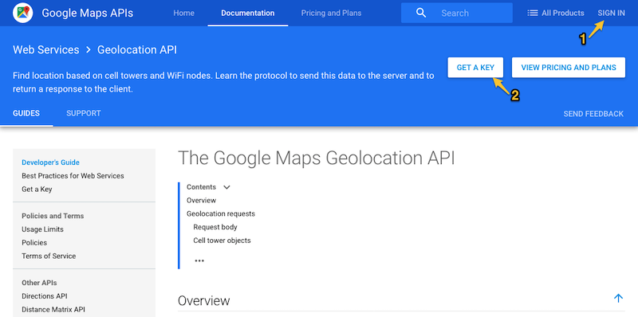
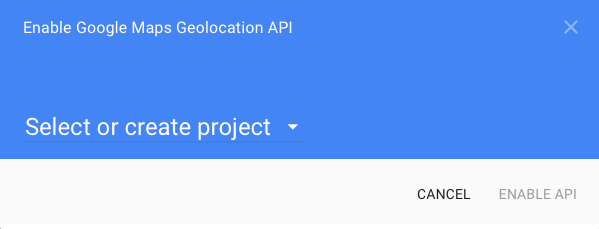
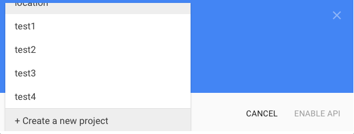
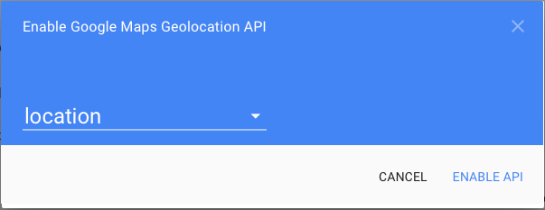
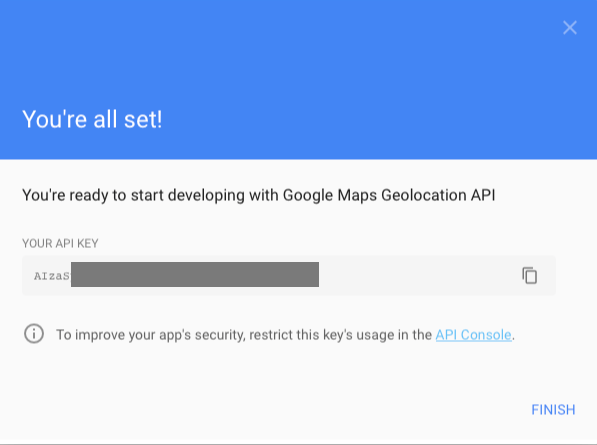
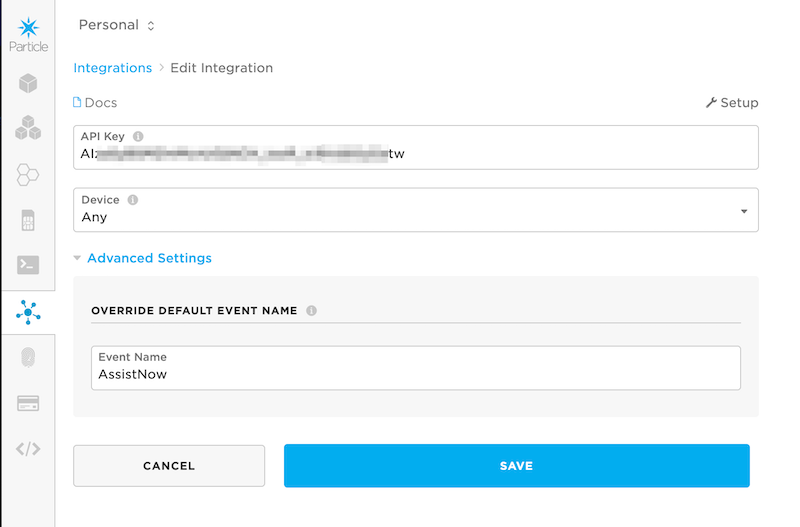
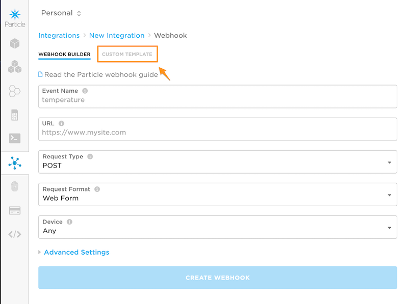
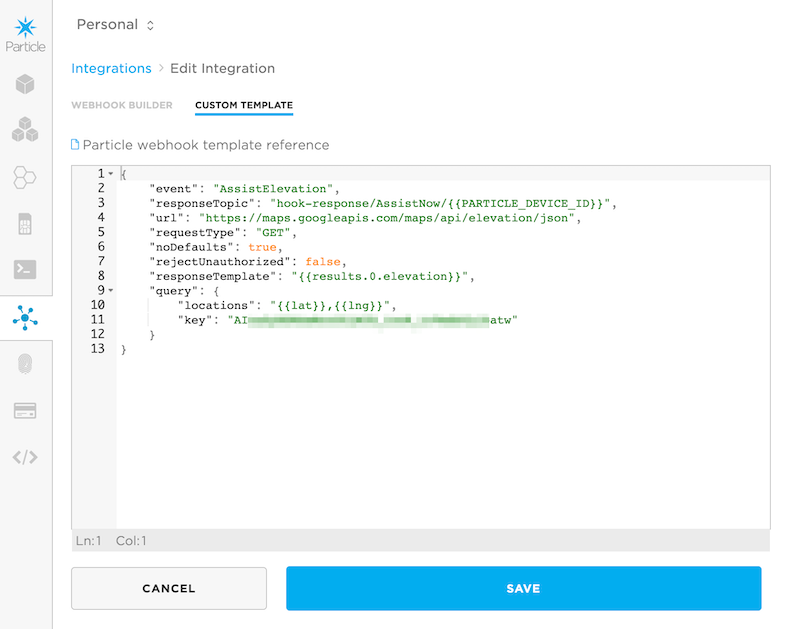

# u-blox AssistNow

**This feature is in beta testing at this time!**

From the u-blox documentation:

> Users would ideally like GNSS receivers to provide accurate position information the moment they are turned on. With standard GNSS receivers there can be a significant delay in providing the first position fix, principally because the receiver needs to obtain data from several satellites and the satellites transmit that data slowly. Under adverse signal conditions, data downloads from the satellites to the receiver can take minutes, hours or even fail altogether.
Assisted GNSS (A-GNSS) is a common solution to this problem and involves some form of reference network of receivers that collect data such as ephemeris, almanac, accurate time and satellite status and pass this onto to the target receiver via any suitable communications link. Such assistance data enables the receiver to compute a position within a few seconds, even under poor signal conditions.

> AssistNow Online is u-blox' end-to-end Assisted GNSS (A-GNSS) solution for receivers that have access to the Internet. Data supplied by the AssistNow Online Service can be directly uploaded to a u-blox receiver in order to substantially reduce Time To First Fix (TTFF), even under poor signal conditions. The system works by collecting data such as ephemeris and almanac from the satellites through u-blox' Global Reference Network of receivers and providing this data to customers in a convenient form that can be forwarded on directly to u-blox receivers.
The AssistNow Online Service uses a simple, stateless, HTTP interface. Therefore, it works on all standard mobile communication networks that support Internet access, including GPRS, UMTS and Wireless LAN. No special arrangements need to be made with mobile network operators to enable AssistNow Online.

The AssetTrackerRK library includes the ability to use AssetNow with u-blox GPS modules, including the Electron AssetTracker V2. It has been tested on the u-blox MAX M8 module in both serial or I2C mode, and should work with other similar members of the u-blox GPS family that support AssistNow online.

This feature cannot be used with GlobalTop PA6H GPS modules including the AssetTrackerV1 and the Adafruit Ultimate GPS.

It works on Gen 2 (Electron, E Series) and Gen 3 (Argon, Boron, B Series SoM) devices, as well.

Of course using AssistNow is completely optional. The GPS module can obtain this information from satellites. Using AssistNow will increase your cellular data usage, but is decreases time to first fix. 

AssistNow is only needed on a cold boot of the GPS, after removing power for several minutes until the supercap on the AssetTracker discharges. As long as the AssetTracker has power (VIN or LiPo) the GPS data will be preserved in the u-blox GPS module and probably won't need AssistNow.

## Requirements

- A compatible u-blox GPS module
- A u-blox AssistNow access token (available at no charge from u-blox, but is required)
- A Google API key for the geolocation and elevation APIs (you may be able to use the free tier)
- A Particle Google Maps integration for geolocation
- A Particle webhook integration for elevation 


| Test | Without AssistNow | AssistNow (no location) | AssistNow (with location) |
| :---: | :---: | :---: | :---: |
| Time to fix | 215 sec. | 70 sec.<sup>1</sup> | 20 sec.<sup>1</sup>  |
| Data usage | 0 bytes | 4.0 Kbytes | 2.7 Kbytes | 
| Number of satellites | 7 | 9 | 9 |
| HDOP<sup>3</sup> | 119 meters | 114 meters | 102 meters |

- <sup>1</sup>Includes the time to connect to cellular.
- <sup>2</sup>Includes the time to connect to cellular and get geolocation information.
- <sup>3</sup>Initial horizontal dilution of precision in meters. Upon first fix, the position is accurate within this many meters. This will decrease if more satellites can be found.

It is also possible to use this library without the Google Maps and webhook integration, however it makes it much less efficient. In the table above, the (no location) shows that using AssistNow without location information does speed time to first fix, however by not as much as with location. Furthermore, since the location is not known, ephemeris for all satellites needs to be downloaded, increasing data usage. When used with location, a subset of the data is downloaded for satellites that are likely to be visible at that location.

If the location cannot be found, for example if the Google geolocation service does not recognize the cell tower ID, or your Wi-Fi location is not known (on the Argon), then the library will automatically fall back to using disableLocation mode.

### AssistNow Token

You need to sign up for an [AssistNow API token](https://www.u-blox.com/en/assistnow-service-registration-form). Basic usage is free, however you do need to sign up and it may a few hours to a few days to get the key.

You'll want to keep this somewhat secret. You do need to include it in your device firmware so it can be used when making the request to the u-blox servers. You can store it as a string constant in your code, or in some other location like EEPROM.

### Google API key for Geolocation and Elevation

In order to use the Google Maps Geolocation and Elevation APIs you need to obtain an API key. You can use a single Google API key for both maps and elevation.

#### Sign up for a Google account

If you do not already have an account, visit the <a href="https://accounts.google.com/signup?hl=en" target="_blank">Google signup page</a>.
Follow the instructions to register for a new account. A Google account
is needed to successfully authenticate with the Google Maps Geolocation
API.

#### Get a Google Geolocation API Key

In order to use the Google Geolocation API, you need an API key. In many cases, you'll be able to take advantage of the free usage tier.

- Go to the [Google Geolocation API page](https://developers.google.com/maps/documentation/geolocation/intro).

- If you are not signed into Google already, sign in (1).

- Use the **Get a Key** button (2) to request a new API key.



- Select or create a project.



- In many cases you'll want to **Create a new project**. Every key is associated with one project, though a project can have a number of different keys, and also be enabled for multiple services.



- I created a new project **location** and use the **Enable API** button to enable it.



- And then you'll be presented with your API key.



Copy your key to the clipboard because you'll need it when you enable your integration.

To view, edit or delete your credentials later, you can use the [Google Developer Credentials Console](https://console.developers.google.com/apis/credentials).

#### Add Google Elevation API to your key

- From the [Google Cloud Platform Console](https://console.cloud.google.com), from the main menu, select **APIs & Services** then **Library**.

- Search for **elevation** and select **Maps Elevation API**.

- Click the blue **Enable** button to enable API access to this service.


#### Enable Billing

Make sure you enable billing on your Google account. Even if you don't exceed the limits of the free tier, you'll get an error 403 if you don't enable billing.

The instructions [can be found here](https://developers.google.com/maps/documentation/geolocation/usage-and-billing).


### Particle Google Maps integration

- Log into the [Particle console](https://console.particle.io).

- Click on **Integrations** in the left icon bar, then **New Integration** then **Google Maps**.

- Enter your Google API key that you got earlier.

- Click on the **Advanced Settings** triangle and change the Event Name to **AssistNow** (no spaces, and match the capitalization).



### Particle webhook integration for elevation 

- In the **Integrations** page in the Particle console, click **New Integration** then **Webhook**.

- Click **Custom Template**.



- Enter the information below into the custom template.

```
{
    "event": "AssistElevation",
    "responseTopic": "hook-response/AssistNow/{{PARTICLE_DEVICE_ID}}",
    "url": "https://maps.googleapis.com/maps/api/elevation/json",
    "requestType": "GET",
    "noDefaults": true,
    "rejectUnauthorized": false,
    "responseTemplate": "{{results.0.elevation}}",
    "query": {
        "locations": "{{lat}},{{lng}}",
        "key": "PASTE_YOUR_GOOGLE_API_KEY_HERE"
    }
}
```

Be sure to put your actual Google API key in place of `PASTE_YOUR_GOOGLE_API_KEY_HERE`.



## Using in your code

The example 11_AssistNowTest is a full example of using AssistNow.

You will want to enable ublox and AssistNow features by adding these two things as global variables in your main application loop file.

```
Ublox ublox;                // Adds in special features of the u-blox GPS models
UbloxAssistNow assistNow;   // Adds in assist now for faster time-to-first-fix
```

In setup(), set the u-blox API key and call the `assistNow.setup()` method:

```
assistNow.withAssistNowKey("PASTE_YOUR_UBLOX_API_KEY_HERE");
assistNow.setup();
```

In loop(), call the ublox and assistNow loop functions:

```
ublox.loop();
assistNow.loop();
```


## Troubleshooting

### USB Serial Debugging

The first thing to do is enable the serial log handler your main application file if you haven't already done so.

```
SerialLogHandler logHandler;
```

Monitor the output while connected by USB serial using `particle serial monitor` or a serial terminal program.

### Console Events

Log into the [Particle console](https://console.particle.io/) and view the **Events** tab. There will be several events posted during the process.

Also go into the AssistNow and AssistElevation integrations and view the integration logs looking or errors.

If you are getting 403 errors on the Google Maps integration, be sure you've enabled billing on your Google Cloud account. Even in the free tier, if you don't enable billing, the maps APIs won't work.

### Detailed Debugging

Detailed debugging in the library can help debug problems in the library itself. The instructions here are for using Particle Workbench.

- If there isn't a folder **AssetTrackerRK** in the lib directory of your project: From the **Command Palette** select **Particle: Install Library** then **AssetTrackerRK**.

- Edit the **project.properties** file and add some `xxx` before the `dependencies.AssetTrackerRK` line:

```
xxxdependencies.AssetTrackerRK=0.3.1
```

This causes the local or cloud compiler to use the locally modified library instead of the cloud version.

- Go into `lib/AssetTrackerRK` and edit `UbloxGPS.cpp`. Uncomment the lines for `UBLOX_DEBUG_VERBOSE_ENABLE` and `ASSISTNOW_DEBUG_ENABLE`.

- Build and run and you should get more verbose serial debug logs.


